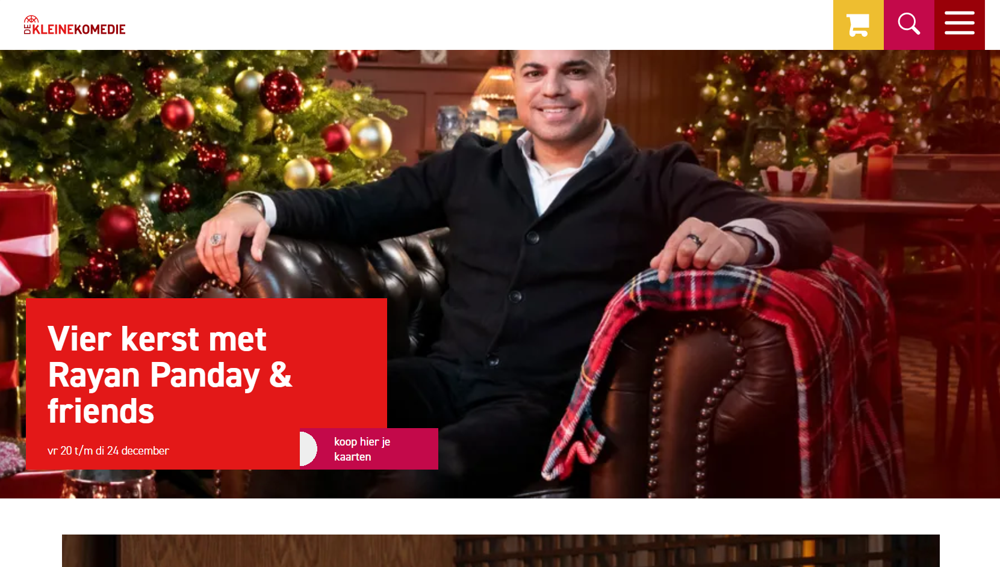
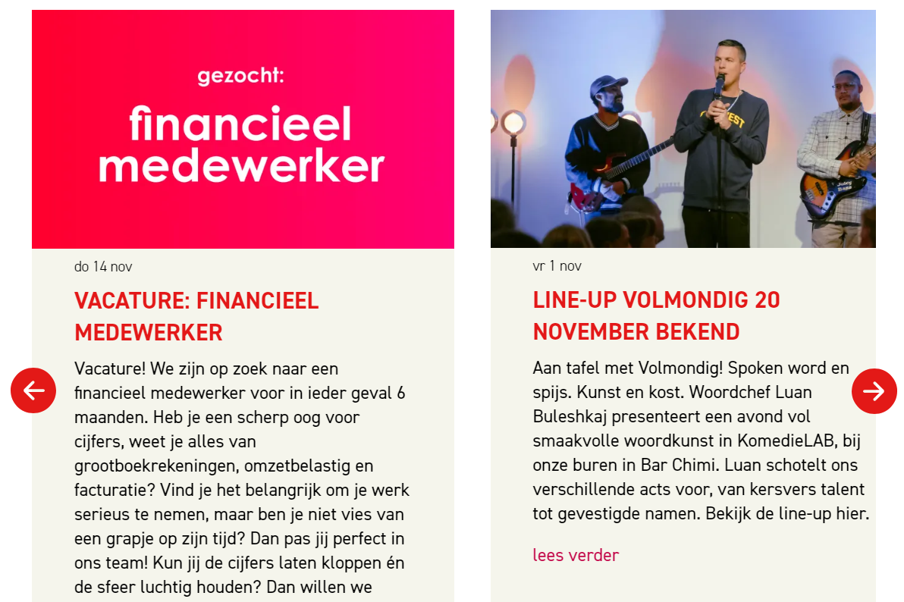

# Procesverslag
Markdown is een simpele manier om HTML te schrijven.  
Markdown cheat cheet: [Hulp bij het schrijven van Markdown](https://github.com/adam-p/markdown-here/wiki/Markdown-Cheatsheet).

Nb. De standaardstructuur en de spartaanse opmaak van de README.md zijn helemaal prima. Het gaat om de inhoud van je procesverslag. Besteedt de tijd voor pracht en praal aan je website.

Nb. Door *open* toe te voegen aan een *details* element kun je deze standaard open zetten. Fijn om dat steeds voor de relevante stuk(ken) te doen.

## Jij

  
uitwerken voor kick-off werkgroep

  ### Auteur:
  Joshua Astiazarain Olivera

  #### Je startniveau:
  Rood

  #### Je focus:
  Responsiveness
 

## Je website

  
uitwerken voor kick-off werkgroep

  ### Je opdracht:
  https://www.dekleinekomedie.nl/

  #### Screenshot(s) van de eerste pagina (small screen): 
  Home 
  

  #### Screenshot(s) van de tweede pagina (small screen):
  Agenda 
  
 

## Toegankelijkheidstest 1/2 (week 1)

  
uitwerken na test in 2e werkgroep

  ### Bevindingen
  Lijst met je bevindingen die in de test naar voren kwamen:
  - Images worden volledig overgeslagen
  - Alleen de links worden gelezen
  - Broodteksten binnen een card worden overgeslagen
  - Op verschillende plekken staan errors in de code
  - De website draait niet mee als de telefoon 180 graden wordt gedraaid
  - De interactieve elementen staan te dicht op elkaar
  - Voor de shows wordt geen list gebruikt
  - Afbeeldingen bevatten geen alt-tekst
  - Er wordt alleen href voor links gebruikt (geen a)
  - Button element wordt niet gebruikt
  - Niet duidelijk dat een nieuwe pagina wordt geopend met screenreader
  - Dark mode wordt niet ondersteund

## Breakdownschets (week 1)

  
uitwerken na afloop 3e werkgroep

  ### de hele pagina: 
  

  ### dynamisch deel (hamburgermenu?): 
  

  ### wellicht nog een dynamisch deel (bijv filter): 
  

## Voortgang 1 (week 2)

  
uitwerken voor 1e voortgang

  ### Stand van zaken
  hier dit ging goed & dit was lastig (neem ook screenshots op van delen van je website en code)
  Goed:
  - Breakdownschets homepagina vertalen naar HTML
  - Korte opdrachten in de les

  Lastig:
  - Breakdownschets filter --> welke elementen worden voor wat gebruikt?
  - Verschillen flexbox en grid en het toepassen hiervan
  - Toegankelijkheid checken bij de originele website

  ### Agenda voor meeting
  samen met je groepje opstellen

  | Joshua         | Julian             | Alycia       |
  | ---            | ---                | ---          |
  | Wanneer nieuwe section, wanneer past het gewoon binnen de parent? | Wanneer grid en wanneer flexbox?  | Tekst op een image    |
  | Tekst selecteren met toetsenbord (tab of iets anders?) | Wat wordt er precies verwacht van ons qua toegankelijkheid? Verwijst naar toegankelijkheids blad van week vorige week. |  |
  | Wanneer grid, wanneer flexbox? | Het minimale aantal van 3 CSS files.  |  |
  | Breakdownschets | Functies binnen de website? (Surface plane) |  |

  ### Verslag van meeting
  hier na afloop snel de uitkomsten van de meeting vastleggen

  - Flexbox - Grid --> Flexbox voor algemenere layout, grid voor specifiekere layout
  - Tekst selecteren --> met semantische HTML komt dat automatisch goed
  - Main css --> styling tekst, nav, basic styling
  - light & dark mode toevoegen
  - Image gebruiken voor logo en dan onzichtbare h1
  - met comments onderdelen aangeven
  - a met img erin bij social media

## Voortgang 2 (week 3)

  
uitwerken voor 2e voortgang

  ### Stand van zaken
  hier dit ging goed & dit was lastig (neem ook screenshots op van delen van je website en code)

  ### Agenda voor meeting
  samen met je groepje opstellen

  | Joshua      | Julian         | Joost   |
  | ---            | ---                | ---          |
  |  Fonts (hoe toe te voegen vanuit file, mag ook vanuit adobe fonts ook met js?) | Welke vorm van afbeeldingen zijn het beste voor toegankelijkheid  | tekst op afbeeldingen    |
  | iconen die geen images zijn | ... | grid |
  | image uit de section achter elementen van de header       | ...                | ...          |
  | viewport issues | ... | ... |

  ### Verslag van meeting
  hier na afloop snel de uitkomsten van de meeting vastleggen

- in algemene stylesheet --> max-width 100% image zodat hij niet groter dan de container wordt
- display block voor geen witruimte tussen de twee items
- object-fit:cover + height en width 100%
- vw ipv fr
- ch = max karakters op een zin.
- clamp() voor meeschalen tekst

## Toegankelijkheidstest 2/2 (week 4)

  
uitwerken na test in 9e werkgroep

  ### Bevindingen
  Lijst met je bevindingen die in de test naar voren kwamen (geef ook aan wat er verbeterd is):
  Dingen die zijn verbetererd:
  - Genoeg ruimte gelaten tussen interactieve elementen
  - List items toegevoegd
  - Alt-teksten bij img's toegevoegd
  - a elementen toegevoegd bij links
  - Skip link toegevoegd om de header over te slaan
  - Achtergrond aan de onleesbare teksten toegevoegd zodat het nu wel leesbaar is

  Ruimte voor verbetering:
  - ondersteuning dark mode

## Voortgang 3 (week 4)

  
uitwerken voor 3e voortgang

  ### Stand van zaken
  hier dit ging goed & dit was lastig (neem ook screenshots op van delen van je website en code)

  ### Agenda voor meeting
  samen met je groepje opstellen

  | Joshua      | Julian         | Mo    |
  | ---            | ---                | ---          |
  | support section  | hamburgermenu             |   |
  | tot hoe groot responsive |  |  |
  | hamburgermenu | |  |
  | carousel            |              |        |

  ### Verslag van meeting
  hier na afloop snel de uitkomsten van de meeting vastleggen

  - div mogen wel voor pure opmaak
  - max-content op row
  - Buttons in alle states opmaken

## Eindgesprek (week 5)

  
uitwerken voor eindgesprek

  ### Je uitkomst - karakteristiek screenshots:
  

  ### Dit ging goed/Heb ik geleerd: 
  Wat er goed ging was het in elkaar zetten van de navigatiebalk, met bijbehorende elementen.
  Dit was ook het onderdeel met Javascript waar ik tegenop zag, maar dit is me uiteindelijk goed afgegaan.

  

  ### Dit was lastig/Is niet gelukt:
  Het carousel-element heb ik veel tijd aan besteed, en werkt nog steeds niet volledig zoals ik zou willen. Je kan er nog steeds ook met je trackpad doorheen scrollen en hij scrollt door te veel artikelen tegelijkertijd. Toch werkt hij goed genoeg en heb ik ook hier met Javascript gewerkt.

  

## Bronnenlijst

  
continu bijhouden terwijl je werkt

  Nb. Wees specifiek ('css-tricks' als bron is bijv. niet specifiek genoeg). 
  Nb. ChatGpT en andere AI horen er ook bij.
  Nb. Vermeld de bronnen ook in je code.

  1. https://www.w3schools.com/accessibility/accessibility_skip_links.php
  2. https://www.dekleinekomedie.nl/
  3. https://www.svgrepo.com/svg/525741/cart-large-minimalistic
  4. https://www.svgrepo.com/svg/529849/sad-circle
  5. https://www.svgrepo.com/svg/522086/cross
  6. https://www.svgrepo.com/svg/479496/magnifying-glass-11
  7. https://codepen.io/shooft/pen/JjQLVeB?editors=1000
  8. https://codepen.io/shooft/pen/xbKwdJr
  9. https://www.svgrepo.com/svg/521965/arrow-left-circle
  10. https://codepen.io/shooft/pen/JjQLVeB?editors=1000
  11. https://www.svgrepo.com/svg/532195/menu
  12. https://www.svgrepo.com/svg/454078/account
  13. ChatGPT (prompt: hoe kan ik semantisch een telefoonnummer opschrijven in html)
  14. https://github.com/rachelandrew/cssgrid-ama/issues/19#issuecomment-272922212
  15. https://www.w3schools.com/css/css3_shadows_box.asp
  16. https://codepen.io/shooft/pen/xbKwdJr?editors=0110
  17. https://www.w3schools.com/howto/howto_css_flip_image.asp
  18. https://www.a11yproject.com/posts/how-to-hide-content/
  19. https://codepen.io/sosuke/full/Pjoqqp
  20. 
  21. Thomas Norden
  22. Tom van Droffelaar
  23. Kim Dekker
  24. Ali Ahmed
  25. En uiteraard Sanne 't Hooft

